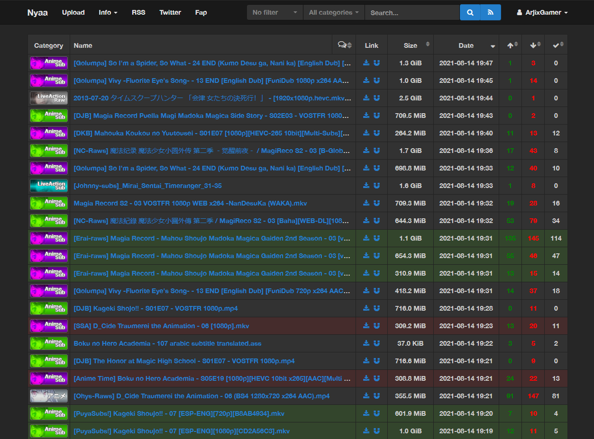
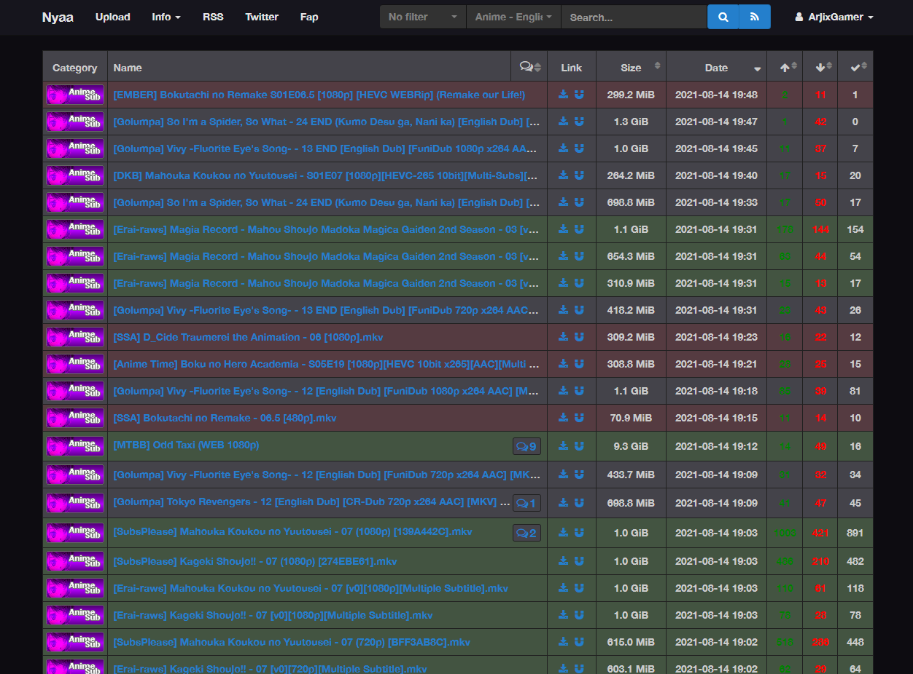
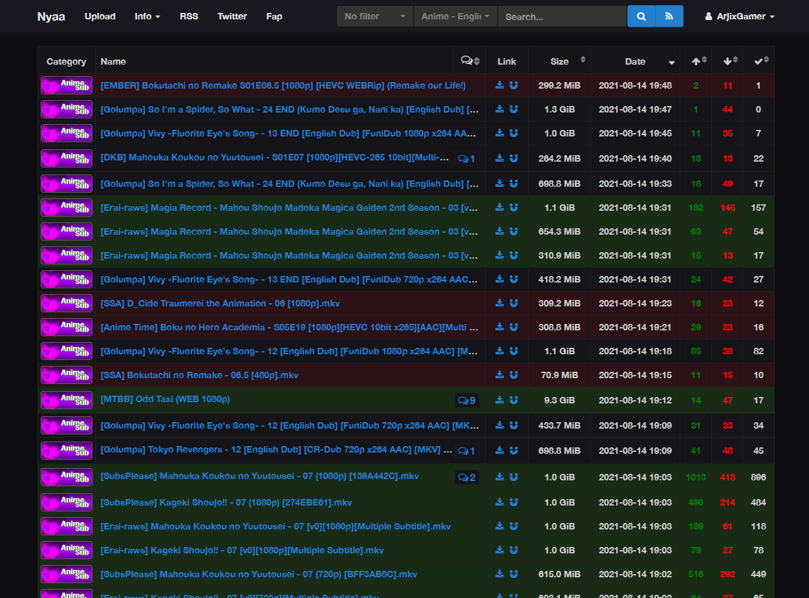

# Nyaa-Utility
Welp, pretty much random stuff i code that enhance the nyaa website.

 

Nyaa-Utility v1.8
=================

Changes on the new version!:
-   Fixed a bug with the notifications. (There is a high chance that you have to  all of your user data in order to fix this.)

So, this extension has the following features:

-   Themes Support! Themes available:

    -   

        
Nyaa Dark (Default nyaa theme)

        
        

    -   

        
Midnight Dusk

        
        

    -   

        
Quicknovel

        
        

*   Filters out dead torrents from the browse section by one of the following rules.
    *   Disabled
    *   0 Seeds
    *   0 Leechers
    *   Both (0 seeds and leechers)
*   Can go to the next available page if the above feature removed all the torrents from the browse section.
*   Adds a user blocking system. (only hides their comments)
*   Adds a tag blocking system. (removes torrents from the browse section based on their tags)
*   Adds a reply feature (in the comments), this feature implements the following.
    *   A  button next to usernames, when clicked it appends the @username of said user.
    *   When a message contains your @username, that message becomes highlighted and the @username gets marked.
*   Adds a subscription feature to subscribe for new comments in torrents.
*   Adds a torrent watcher feature to get notified for new torrents in the followed feeds.  
    To use this you simply click the button.  
    When the button is blue it means that the current feed is not being followed.  
    Clicking it will follow that feed.  
      
    When the button is red it means that the current feed is already followed.  
    Clicking it will unfollow that feed.

  
If you want to request for a new feature, then go and create an issue on the [issue tracker](https://github.com/ArjixWasTaken/Nyaa-Utility/issues)
